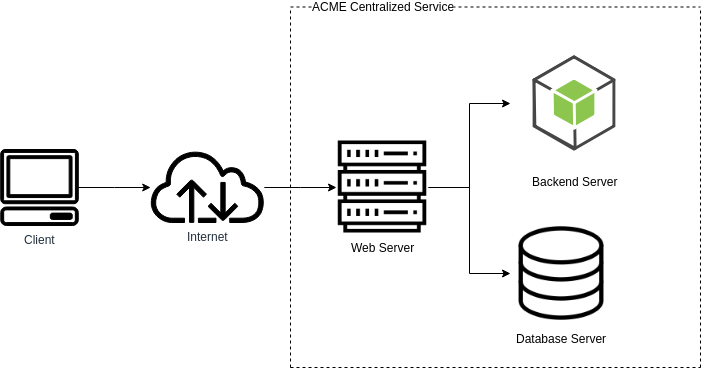

# <!--fit--> What if Twitter was built on Catalyst?
Blockchain live 2019 - Developer Den
Created by @nshcore


---
# Catalyst Network is a full stack web3 solution.

---
# web 1.0
## Information Economy


---
# web 2.0
## Platform Economy


---

"After years of secretly monitoring the public, we were astounded so many people would willingly publicize where they live, their religious and political views and alphabetized list of all their friends, personal e-mail addresses, phone numbers, hundreds of photos of themselves and even status updates about what they were doing moment to moment. It is truly a dream come true for the CIA." - Christopher Sartinsky, Deputy CIA Director (The Onion) 

---

# Target data mining


---

Take a fictional Target shopper named Jenny Ward, who is 23, lives in Atlanta and in March bought cocoa-butter lotion, a purse large enough to double as a diaper bag, zinc and magnesium supplements and a bright blue rug. There’s, say, an 87 percent chance that she’s pregnant and that her delivery date is sometime in late August.


---
# Facebook: The Social Experiment(s)

---
# The Role of Social Networks in Information Diffusion

Date: 2010
Users violated: 253,000,000

---
# Social Influence and Political Mobilization

Date: 2010
Users violated: 61,000,000

---
# Social Influence Advertising

Date: 2011
Users violated: 29,000,000

---
# The Spread of Emotion

Date: 2011
Users violated: 151,000,000

---
# Emotional Contagion

Date: 2012
Users violated: 689,003

---
# Self-Censorship

Date: 2012
Users violated: 4,000,000

---
# Selection Effects In Online Sharing

Date: 2012
Users violated: 1,000,000

---
# NSA Surveillance Program

Date: 2001
Users violated: Every web user.


---
# The Client Server Web


---
# <!--fit--> 1 + 2 = web3.0

---
# Web 3.0
## Token Economy


___

# Centralised Web 2 Platform


---

# Decentralised Web 3 Platform


---

# Catalyst Twitter

```
+---Twitter.Node--------------------------------------------------------------+
|                                                                             |
| +-----------+                                                               |
| |           |                                                               |
| |           |                                                               |
| | Twitter   |                                                               |
| | Module    |                                                               |
| |           |                                                               |
| +-----------+                                                               |
| +-----------+ +---------+ +---------+                                       |
| |           | |         | |         |                                       |
| |           | |         | |         |                                       |
| | Web3 Api  | |POA.     | |POA.     |                                       |
| |           | |Consensus| |Discovery|                                       |
| |           | |         | |         |                                       |
| |           | |         | |         |                                       |
| +-----------+ +---------+ +---------+                                       |
|                                                                             |
| +-Catalyst.Core.Modules---------------------------------------------------+ |
| | +---------+ +---------+ +---------+ +---------+ +---------+ +---------+ | |
| | |         | |         | |         | |         | |         | |         | | |
| | |         | |         | |         | |         | |         | |         | | |
| | |         | |         | |         | |         | |         | |         | | |
| | | Ledger  | | Mempool | |KeySigner| | KeyStore| | Crypto  | | Dfs     | | |
| | |         | |         | |         | |         | |         | |         | | |
| | |         | |         | |         | |         | |         | |         | | |
| | |         | |         | |         | |         | |         | |         | | |
| | +---------+ +---------+ +---------+ +---------+ +---------------------+ | |
| +-------------------------------------------------------------------------+ |
|                                                                             |
| +-------------------------------------------------------------------------+ |
| |                                                                         | |
| |  Catalyst.Core.Lib                                                      | |
| |                                                                         | |
| +-------------------------------------------------------------------------+ |
+-----------------------------------------------------------------------------+
```
---

# Early Access Program
## Sign up to the Catalyst Network EAP

https://catalystnet.org/eap

---

# Thanks

twitter.com/nshcore
github.com/nshcore